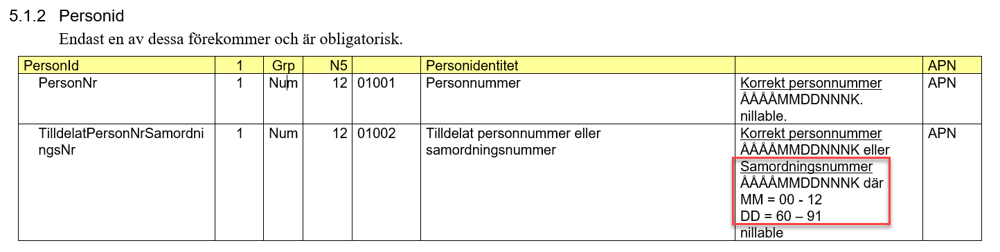

# ActiveLogin.Identity

[](https://opensource.org/licenses/MIT)
[](https://activesolution.visualstudio.com/ActiveLogin/_build/latest?definitionId=190&branchName=master)
[](https://join.slack.com/t/activelogin/shared_invite/enQtODQ0ODYyMTgxMjg0LWJhODhiZmFmODYyMWMzZWEwMjdmYWU2NGRhZmQ0MTg0MzIwNzA2OTM3NTJjOTk2MmE1MzIwMzkzYjllMjAyNzg)
[](https://twitter.com/ActiveLoginSE)

ActiveLogin.Identity provides parsing and validation of Swedish identities such as Personal Identity Number (svenskt personnummer) and Coordination Number (samordningsnummer). Built on NET Standard and packaged as NuGet-packages they are easy to install and use on multiple platforms.

## Features
- :id: .NET parser for Swedish Personal Identity Number (Svenskt personnummer)
- :penguin: Cross platform: Targets .NET Standard 2.0
- :heavy_check_mark: Strong named
- :lock: GDPR Compliant
- :calendar: Extracts metadata such as date of birth and gender
- :large_blue_diamond: Written in F# and C# and works great with VB.NET as well
- :white_check_mark: Well tested

## Table of contents

* [Project & Packages overview](#project--packages-overview)
* [Getting started](#getting-started)
    + [1. Install the NuGet package](#1-install-the-nuget-package)
    + [2. Use the library in your C# project](#2-use-the-library-in-your-c-project)
        - [SwedishPersonalIdentityNumber](#swedishpersonalidentitynumber)
        - [SwedishCoordinationNumber](#swedishcoordinationnumber)
    + [3. Use the library in your F# project](#3-use-the-library-in-your-f-project)
    + [4. Browse tests and samples](#4-browse-tests-and-samples)
* [FAQ](#faq)
    + [What definition are the implementations based on?](#what-definition-are-the-implementations-based-on)
    + [What formats do you support parsing?](#what-formats-do-you-support-parsing)
    + [Why are you calling it "Swedish Personal Identity Number" and not Social Security Number?](#why-are-you-calling-it-swedish-personal-identity-number-and-not-social-security-number)
    + [What data are you using for tests and samples?](#what-data-are-you-using-for-tests-and-samples)
    + [When should I use `...InSpecificYear(...)`?](#when-should-i-use-inspecificyear)
* [Active Login](#active-login)
    + [Contribute](#contribute)
    + [Stay updated and join the discussion](#stay-updated-and-join-the-discussion)
    + [License & acknowledgements](#license--acknowledgements)
    + [Sponsors](#sponsors)
    + [Support & Training](#support--training)

## Project & Packages overview

CI-builds from master of all packages are available in [our Azure DevOps Artifacts feed](https://dev.azure.com/activesolution/ActiveLogin/_packaging?_a=feed&feed=ActiveLogin-CI).

| Project | Description | NuGet |
| ------- | ----------- | ----- |
| [ActiveLogin.Identity.Swedish](https://github.com/ActiveLogin/ActiveLogin.Identity/tree/master/src/ActiveLogin.Identity.Swedish) | .NET classes handling Personal Identity Number | [](https://www.nuget.org/packages/ActiveLogin.Identity.Swedish/) |
| [ActiveLogin.Identity.Swedish.AspNetCore](https://github.com/ActiveLogin/ActiveLogin.Identity/tree/master/src/ActiveLogin.Identity.Swedish.AspNetCore) | Validation attributes for ASP.NET Core. | [](https://www.nuget.org/packages/ActiveLogin.Identity.Swedish.AspNetCore/) |
| [ActiveLogin.Identity.Swedish.TestData](https://github.com/ActiveLogin/ActiveLogin.Identity/tree/master/src/ActiveLogin.Identity.Swedish.TestData) | Provides Swedish Identity Numbers test data. | [](https://www.nuget.org/packages/ActiveLogin.Identity.Swedish.TestData/) |

## Getting started

### 1. Install the NuGet package

ActiveLogin.Identity is distributed as [packages on NuGet](https://www.nuget.org/profiles/ActiveLogin), install using the tool of your choice, for example _dotnet cli_:

```console
dotnet add package ActiveLogin.Identity.Swedish
```

### 2. Use the library in your C# project

### SwedishPersonalIdentityNumber

`SwedishPersonalIdentityNumber` provides parsing methods such as `SwedishPersonalIdentityNumber.Parse()` and `SwedishPersonalIdentityNumber.TryParse()` that can be used like this:

```c#
var rawPersonalIdentityNumber = "990807-2391";
if (SwedishPersonalIdentityNumber.TryParse(rawPersonalIdentityNumber, out var personalIdentityNumber))
{
    Console.WriteLine("SwedishPersonalIdentityNumber");
    Console.WriteLine(" .ToString(): {0}", personalIdentityNumber.ToString());
    Console.WriteLine(" .To10DigitString(): {0}", personalIdentityNumber.To10DigitString());
    Console.WriteLine(" .To12DigitString(): {0}", personalIdentityNumber.To12DigitString());

    Console.WriteLine(" .GetDateOfBirthHint(): {0}", personalIdentityNumber.GetDateOfBirthHint().ToShortDateString());
    Console.WriteLine(" .GetAgeHint(): {0}", personalIdentityNumber.GetAgeHint().ToString());

    Console.WriteLine(" .GetGenderHint(): {0}", personalIdentityNumber.GetGenderHint().ToString());
    
    // IsTestNumber is an extension method from the package ActiveLogin.Identity.Swedish.TestData
    Console.WriteLine(" .IsTestNumber(): {0}", personalIdentityNumber.IsTestNumber().ToString());
}
else
{
    Console.Error.WriteLine("Unable to parse the input as a SwedishPersonalIdentityNumber.");
}
```

The code above would output (as of 2018-07-23):

```text
SwedishPersonalIdentityNumber
 .ToString(): 199908072391
 .To10DigitString(): 990807-2391
 .To12DigitString(): 199908072391
 .GetDateOfBirthHint(): 1999-08-07
 .GetAgeHint(): 18
 .GetGenderHint(): Male
 .IsTestNumber(): True
```

#### Hints

Some data, such as DateOfBirth, Age and Gender can't be guaranteed to reflect the truth due to the limited quantity of personal identity numbers per day.
Therefore they are exposed as extension methods in the C# api and are suffixed with `Hint` to reflect this. They are also placed in a separate namespace `ActiveLogin.Identity.Swedish.Extensions`. In the F# api these functions are available in the `ActiveLogin.Identity.Swedish.FSharp.SwedishPersonalIdentityNumber.Hints` module.

#### ASP.NET Core MVC

If used to validate input in an ASP.NET Core MVC project, the `SwedishPersonalIdentityNumberAttribute` can be used like this:

```c#
public class SampleDataModel
{
    [SwedishPersonalIdentityNumber]
    public string SwedishPersonalIdentityNumber { get; set; }
}
```

The `SwedishPersonalIdentityNumber` attribute is available through a separate package:

```console
dotnet add package ActiveLogin.Identity.Swedish.AspNetCore
```

### SwedishCoordinationNumber

`SwedishCoordinationNumber` provides parsing methods such as `SwedishCoordinationNumber.Parse()` and `SwedishCoordinationNumber.TryParse()` that can be used like this:

```c#
var rawCoordinationNumber = "680164-2395";
if (SwedishCoordinationNumber.TryParse(rawCoordinationNumber, out var coordinationNumber))
{
    Console.WriteLine("SwedishCoordinationNumber");
    Console.WriteLine(" .ToString(): {0}", coordinationNumber.ToString());
    Console.WriteLine(" .To10DigitString(): {0}", coordinationNumber.To10DigitString());
    Console.WriteLine(" .To12DigitString(): {0}", coordinationNumber.To12DigitString());
    Console.WriteLine(" .RealDay: {0}", coordinationNumber.RealDay;

    Console.WriteLine(" .GetDateOfBirthHint(): {0}", coordinationNumber.GetDateOfBirthHint().ToShortDateString());
    Console.WriteLine(" .GetAgeHint(): {0}", coordinationNumber.GetAgeHint().ToString());

    Console.WriteLine(" .GetGenderHint(): {0}", coordinationNumber.GetGenderHint().ToString());
    
    // IsTestNumber is an extension method from the package ActiveLogin.Identity.Swedish.TestData
    Console.WriteLine(" .IsTestNumber(): {0}", coordinationNumber.IsTestNumber().ToString());
}
else
{
    Console.Error.WriteLine("Unable to parse the input as a SwedishCoordinationNumber.");
}
```

The code above would output (as of 2018-07-23):

```text
SwedishCoordinationNumber
 .ToString(): 199908072391
 .To10DigitString(): 990807-2391
 .To12DigitString(): 199908072391
 .RealDay: 7
 .GetDateOfBirthHint(): 1999-08-07
 .GetAgeHint(): 18
 .GetGenderHint(): Male
 .IsTestNumber(): True
```

#### Hints

Some data, such as DateOfBirth, Age and Gender can't be guaranteed to reflect the truth due to the limited quantity of personal identity numbers per day.
Therefore they are exposed as extension methods in the C# api and are suffixed with `Hint` to reflect this. They are also placed in a separate namespace `ActiveLogin.Identity.Swedish.Extensions`. In the F# api these functions are available in the `ActiveLogin.Identity.Swedish.FSharp.SwedishCoordinationNumber.Hints` module.

#### ASP.NET Core MVC

SwedishCoordinationNumberAttribute: To be added.

### 3. Use the library in your F# project

`open ActiveLogin.Swedish.Identity.FSharp`

The `SwedishPersonalIdentityNumber`-module provides functions for parsing, creating and converting a `SwedishPersonalIdentityNumber` to its 10- or 12-digit string representation.

```fsharp
"990807-2391" 
|> SwedishPersonalIdentityNumber.parse 
|> function 
| Ok pin -> 
    printfn "%A" pin
    pin |> SwedishPersonalIdentityNumber.to10DigitString |> printfn "to10DigitString: %s"
    pin |> SwedishPersonalIdentityNumber.to12DigitString |> printfn "to12DigitString: %s"
    pin |> SwedishPersonalIdentityNumber.Hints.getDateOfBirthHint |> (fun date -> date.ToShortDateString() |> printfn "getDateOfBirthHint: %s")
    pin |> SwedishPersonalIdentityNumber.Hints.getAgeHint |> printfn "getAgeHint: %i"
    pin |> SwedishPersonalIdentityNumber.Hints.getGenderHint |> printfn "getGenderHint: %A"
    
    // isTestNumber is an extension from the package ActiveLogin.Identity.Swedish.FSharp.TestData
    pin |> SwedishPersonalIdentityNumber.isTestNumber |> printfn "isTestNumber: %b"
| Error e -> printfn "Not a valid Swedish personal identity number. Error %A" e 
```

The code above would output (as of 2018-07-23):

```text
{Year = Year 1999;
 Month = Month 8;
 Day = Day 7;
 BirthNumber = BirthNumber 239;
 Checksum = Checksum 1;}
to10DigitString: 990807-2391
to12DigitString: 199908072391
getDateOfBirthHint: 1999-08-07
getAgeHint: 18
getGenderHint: Male
isTestNumber: true
```

### 4. Browse tests and samples

For more usecases, samples and inspiration; feel free to browse our unit tests and samples:

* [C# ConsoleSample](https://github.com/ActiveLogin/ActiveLogin.Identity/tree/master/samples/ConsoleSample.CSharp)
* [F# ConsoleSample](https://github.com/ActiveLogin/ActiveLogin.Identity/tree/master/samples/ConsoleSample.FSharp)
* [ActiveLogin.Identity.Swedish.Test](https://github.com/ActiveLogin/ActiveLogin.Identity/tree/master/test/ActiveLogin.Identity.Swedish.Test)
* [ActiveLogin.Identity.Swedish.AspNetCore.Test](https://github.com/ActiveLogin/ActiveLogin.Identity/tree/master/test/ActiveLogin.Identity.Swedish.AspNetCore.Test)

## FAQ

### What definition are the implementations based on?

#### Swedish Personal Identity Number

The implementation is primarily based on the definition defined in Swedish Law:

* [Folkbokföringslagen (FOL 18 §)](https://www.riksdagen.se/sv/dokument-lagar/dokument/svensk-forfattningssamling/folkbokforingslag-1991481_sfs-1991-481#P18)

But when there have been ambiguities we have also read more info and samples from these links from Swedish authorities:

* [Skatteverket (English)](https://www.skatteverket.se/servicelankar/otherlanguages/inenglish/individualsandemployees/livinginsweden/personalidentitynumberandcoordinationnumber.4.2cf1b5cd163796a5c8b4295.html)
* [Skatteverket (Swedish)](https://www.skatteverket.se/privat/folkbokforing/personnummerochsamordningsnummer.4.3810a01c150939e893f18c29.html)
* [Statistiska Centralbyrån (Swedish)](https://www.scb.se/contentassets/8d9d985ca9c84c6e8d879cc89a8ae479/ov9999_2016a01_br_be96br1601.pdf)

Worth noticing is that the date part is not guaranteed to be the exact date you were born, but can be changed for another date within the same month.

#### Swedish Coordination Number

The implementation is primarily based on the definition defined in Swedish Law:

* [Folkbokföringslagen (FOL 18a §)](https://www.riksdagen.se/sv/dokument-lagar/dokument/svensk-forfattningssamling/folkbokforingslag-1991481_sfs-1991-481#P18a)

But when there have been ambiguities we have also read more info and samples from these links from Swedish authorities:

* [Skatteverket (Swedish)](https://www4.skatteverket.se/rattsligvagledning/edition/2019.8/330243.html)
* [Skatteverket (Swedish)](https://www4.skatteverket.se/rattsligvagledning/edition/2019.8/330251.html)
* [Skatteverket (English)](https://www.skatteverket.se/servicelankar/otherlanguages/inenglish/individualsandemployees/livinginsweden/personalidentitynumberandcoordinationnumber.4.2cf1b5cd163796a5c8b4295.html#h-Coordinationnumber)

In summary: According to these definitions a coordination number is the same thing as a personal identity number, but you add 60 to the day part.

##### Exceptions to the definition

There is one issue though, in reality Skatteverket themselves does not follow either the definition in law or the definition on their own website.
When we looked into the dataset of [official testdata](https://skatteverket.entryscape.net/store/9/resource/164) we noticed three specific issues:

- There are cases when the month part (YY*MM*DD-IIIC) is set to 00
- There are cases when the day part (YYMM*DD*-IIIC) is set to 60 (Day would equal: 00)
- There are cases when the day part (YYMM*DD*-IIIC) is set to 89, 90 and 91 (Day would equal: 29, 30, 31) in a months where those dates do not exists. I.e. 29 and 30 in february (non leap year), 30 in february (leap year) and 31 in months that only have 30 days.

When we asked Skatteverket explicitly about this distinction between law/definition and reality we were given this explanation:

"A coordination can be issued even when the data (Date of birth) can not be confirmed. In this case, 00 might appear both for month and for day."

When asked for some public documentation on this, the closest thing Skatteverket has is the developer documentation for [Navet](https://www.skatteverket.se/foretagochorganisationer/myndigheter/informationsutbytemellanmyndigheter/navethamtauppgifteromfolkbokforing.4.18e1b10334ebe8bc80001754.html?q=Navet
).

In "[Bilaga 7 XML-struktur](https://www.skatteverket.se/download/18.515a6be615c637b9aa47c35/1558443238091/na_bilaga7_XML_struktur.docx)" there is a definition under "5.1.2 Personid" that states that Month has a range of 00-12 and Day has a range of 60-91 (00-31 when subtracting 60).



We do not agree that it follows from **Day has a range of 60-91** (00-31 when subtracting 60) that days in the range **29-31** are valid days for **any** month in the year. Skatteverket has not been able to present us with any official documentation to support their interpretation. Nevertheless we have decided to go with the less strict interpretation in our implementation simply because we want to avoid false negatives when parsing an identity number.

### What formats do you support parsing?

#### Swedish Personal Identity Number

It will try cleaning away any invalid chars, while still preserving digits and + when that applies.

The "standard" ways of input would be in any of these formats:

* YYMMDD-BBBC
* YYMMDD+BBBC
* YYMMDDBBBC
* YYYYMMDDBBBC

But it also supports other variations such as:

* YYMMDD BBBC
* YYYYMMDD-BBBC
* YYYYMMDD BBBC
* YYYY MM DD BBB C
* YY-MM-DD-BBBC

And basically anything else that can be cleaned and parsed :)

##### Explanations

* **YY:** Year
* **MM:** Month
* **DD:** Day
* **BBB:** Birth number
* **C:** Checksum

#### Swedish Coordination Number

As the definition of coordination number is very close to personal identity number, the section above applies to coordination number as well.
It will try cleaning away any invalid chars, while still preserving digits and + when that applies.

The "standard" ways of input would be in any of these formats:

* YYMMDD-IIIC
* YYMMDD+IIIC
* YYMMDDIIIC
* YYYYMMDDIIIC

But, as described in [Exceptions to the definition](#exceptions-to-the-definition), a coordination number can have 00 for month and 60 (00) for day.
Also, for a coordination number we have an individual number instead of birth number.

##### Explanations

* **YY:** Year
* **MM:** Month
* **DD:** Day
* **III:** Individual number
* **C:** Checksum

### Why are you calling it "Swedish Personal Identity Number" and not Social Security Number?

The Swedish word "personnummer" is translated into ["personal identity number" by Skatteverket](https://www.skatteverket.se/servicelankar/otherlanguages/inenglish/individualsandemployees/livinginsweden/personalidentitynumberandcoordinationnumber.4.2cf1b5cd163796a5c8b4295.html) and that's the translation we decided on using as it's used in official documents.

Unfortunately the term "social security number" or SSN is often used even for a swedish personal identity number, even though that is misleading as a [SSN is something used in the United States](https://en.wikipedia.org/wiki/Social_Security_number) and should not be mixed up with a PIN.

### What data are you using for tests and samples?

To comply with GDPR and not no expose any real PINs, we are using the official test data for Swedish Personal Identity Numbers [provided by Skatteverket](https://skatteverket.entryscape.net/catalog/9/datasets/147).

If you need to use test numbers yourself, for example if you need to write tests using personal identity numbers, but want to avoid violating GDPR, we provide a [nuget package](https://www.nuget.org/packages/ActiveLogin.Identity.Swedish.TestData/) with a simple api to get random test numbers or strings. You can also check if a personal identity number is a test number.

#### C# : Swedish Personal Identity Number
```csharp
using ActiveLogin.Identity.Swedish.TestData; 

var aTestNumber = SwedishPersonalIdentityNumberTestData.GetRandom();
aTestNumber.IsTestNumber(); // => true
```

#### C# : Swedish Coordination Number
```csharp
using ActiveLogin.Identity.Swedish.TestData; 

var aTestNumber = SwedishCoordinationNumberTestData.GetRandom();
aTestNumber.IsTestNumber(); // => true
```

#### F# : Swedish Personal Identity Number
```fsharp
open ActiveLogin.Identity.Swedish.TestData.FSharp

let aTestNumber = SwedishPersonalIdentityNumberTestData.getRandom()
aTestNumber |> SwedishPersonalIdentityNumber.isTestNumber // => true
```

#### F# : Swedish Coordination Identity Number
```fsharp
open ActiveLogin.Identity.Swedish.TestData.FSharp

let aTestNumber = SwedishCoordinationNumberTestData.getRandom()
aTestNumber |> SwedishCoordinationNumber.isTestNumber // => true
```

### When should I use `...InSpecificYear(...)`?

Some forms of a Swedish Personal Identity Number and Swedish Coordination Number depends of the age of the person it represents.
The "-" will be replaced with a "+" on January 1st the year a person turns 100 years old. Therefore these methods (`.To10DigitStringInSpecificYear(...)`, `.ParseInSpecificYear(...)`, `.TryParseInSpecificYear(...)`) exists to define at what year the the data should be represented or parsed.
Useful for parsing old data or printing data for the future.

---

## Active Login

_Integrating your systems with market leading authentication services._

Active Login is an Open Source project built on .NET Standard that makes it easy to integrate with leading Swedish authentication services like [BankID](https://www.bankid.com/).

It also provide examples of how to use it with the popular OpenID Connect & OAuth 2.0 Framework [IdentityServer](https://identityserver.io/) and provides a template for hosting the solution in Microsoft Azure.
In addition, Active Login also contain convenient modules that help you work with and handle validation of Swedish Personal Identity Number (svenskt personnummer).

### Contribute

We are very open to community contributions to Active Login.
Please see our [contribution guidelines](CONTRIBUTING.md) before getting started.

### Stay updated and join the discussion

The three primary ways to interact and stay updated with Active Login are:

- [Watch our GitHub repo](https://github.com/ActiveLogin/ActiveLogin.Identity/watchers)
- [Slack](https://join.slack.com/t/activelogin/shared_invite/enQtODQ0ODYyMTgxMjg0LWJhODhiZmFmODYyMWMzZWEwMjdmYWU2NGRhZmQ0MTg0MzIwNzA2OTM3NTJjOTk2MmE1MzIwMzkzYjllMjAyNzg)
- [Twitter](https://twitter.com/ActiveLoginSE)

### License & acknowledgements

Active Login is licensed under the very permissive [MIT license](https://opensource.org/licenses/MIT) for you to be able to use it in commercial or non-commercial applications without many restrictions.

Active Login is built on or uses the following great open source products:

* [.NET Core](https://github.com/dotnet/core)
* [FSharp](https://github.com/fsharp/fsharp)
* [XUnit](https://github.com/xunit/xunit)
* [Expecto](https://github.com/haf/expecto)
* [FsCheck](https://github.com/fscheck/FsCheck)
* [Unquote](https://github.com/SwensenSoftware/unquote)
* [BenchmarkDotNet](https://github.com/dotnet/BenchmarkDotNet)

### Sponsors

Active Solution is the main sponsor of Active Login. Active Solution is located in Stockholm (Sweden) and provides IT consulting with focus on web, cloud and AI.


_We deliver tomorrow's cloud solutions, today. Our costumers choose us because we are engaged, flexible and efficient. We attract the brightest talent and are one of Microsoft's most valued partners._

[https://www.activesolution.se/](https://www.activesolution.se/)

### Support & Training

If you need help with implementing Active Login, there are commercial support & training options available.
See [ActiveLogin.net](https://activelogin.net#support) for more details.
